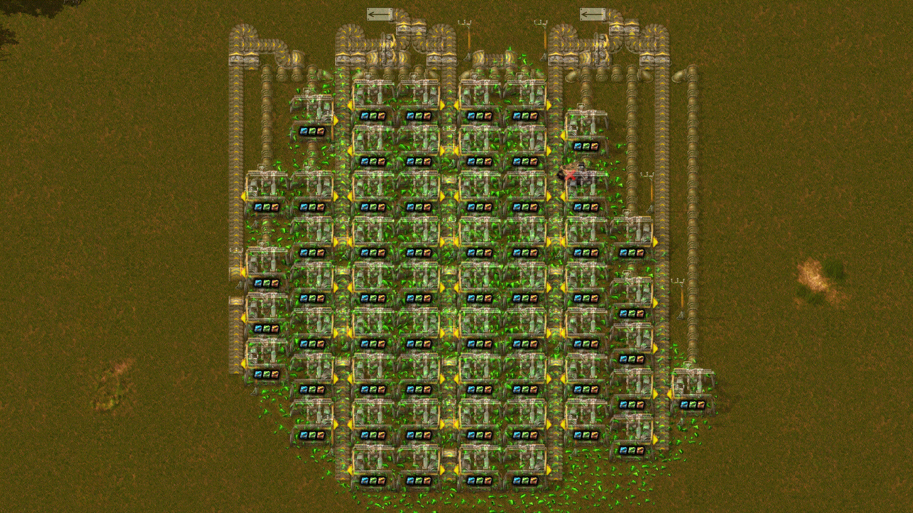
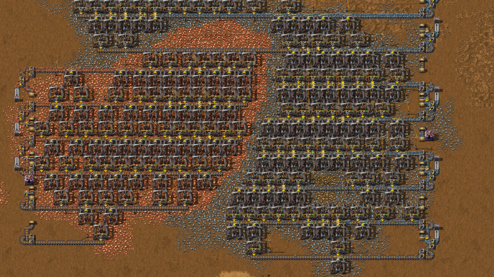
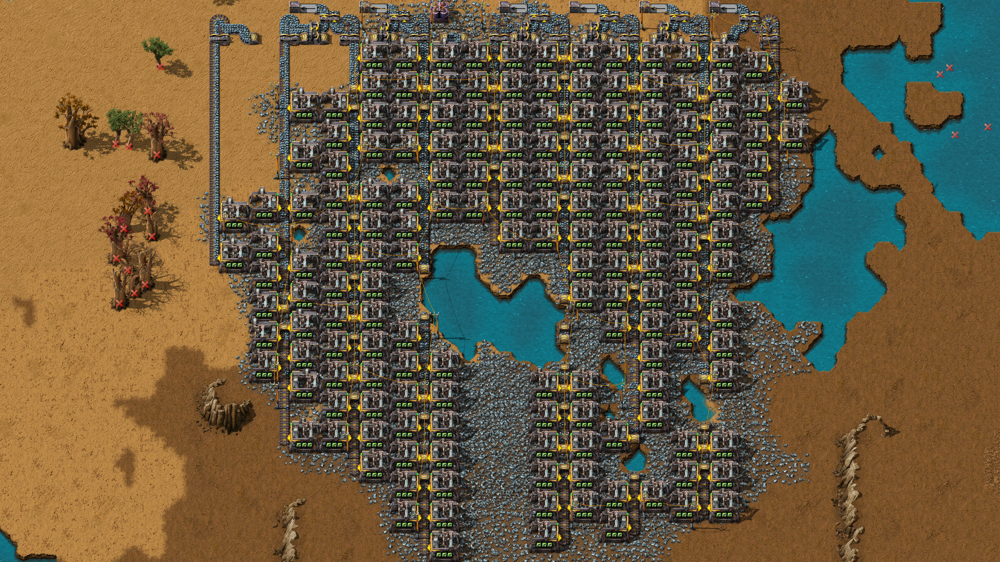

# factorio-mine-planner

## Description
Tool for creating mines. The script can be used from command line for unmodded saves.
Use: Get a mine planner blueprint from the mod's gui then place it over an ore patch. The mod plans drills preferring longevity over initial speed, merges output into full belts, connects them with poles and pipes respecting obstacles.
Aim: Blueprints based outposts result in numerous drills that will deplete quickly. Manaully removing useless drills, fixing obstacle issues and making a good merger is tedious after a while. Automating this process allows you to focus on other aspects of the game.

## Examples

## Ingame console script version
The content of control.lua can be copied into the command line even without the mod installed. This can be used for unmodded non-cheat worlds. Save game &rarr; plan mine &rarr; save complete mine blueprint &rarr; load save &rarr; re-apply mine blueprint
(The mine blueprint, not the planner. Without the mod/script the planner is just a tile blueprint)

## Limitations
- Electric mining drill, it's size and mining area are hard coded.
- Performance limitation: impractically slow on huge ore patches.
- Imperfect clogging approximation: significant margin(overproduction) to ensure - full belts.
- Needs wide, clear rows for the merger.
- Shoulder lanes could often be belted and piped into their neighbour lanes.
- Poles, belts and pipes are not minimized.
- Single ore type, no mixing. Ore entity closest to cursor is selected.
- Mine evaluation is debatable.

## Mine evaluation
Over time, drills will deplete. A value of the output might also decrease as the mine/resource is no longer wanted. The drills, infrastructure and space might not worth the reduced, out-teched and outgrown output anymore. In other words, an ore now is worth more than an ore hours from now. The decrese of value over time is modeled with ore value half-life.

Secondly, short lived drills are avoided. Handling initial output results in overbuilding infrastructure. Otherwise, they will get output blocked. Output blocked drills are can be costly with high tier modules and are unelegant. Instead, the script prefers high minimum drill lifetime.

Finally, output targets. Processing infrastructure is often scaled in steps. For example, 1,2,4 belt train loaders. The mine is expected to satisfy one of these parameterable targets with some margin.

## Drill placement
**Layout**: 4 clear rows for merging, straight belt lanes every 7th column, drills on both sides of the belt, turned inward. Poles wherever they fit.
Effective ore amount: Each tile of ore may be shared by multiple drills. It's effective value is divided up evenly.

**Drill density**: How many drills can the effective mining area around this tile support? {<1: no drill will be placed, >2: overlapping drill areas are allowed, 1<_<2: drill should be spaced) The parameter for this is how much effective ore should a drill have.

**Drill placing/spacing**: Column of drills are independent. Each line assumes it's column neighbours from the drill density approximation. Drills in each column are placed in a single pass leaving gaps according to drill density. Since belt lanes are every 7th tile, all 7 lane offsets are tried and the best is chosen.

The build process is considered as a function `effective ore per drill` -> `drills`
Finding the `effective ore per drill` for the best `drills` is an optimization problem.
The value of a `drills` solution is the integral of output ore value over the lifetime of the shortest lifetime drill. (ore value decreases with ore value half-life)
It first ignores output targets, to find a value peak. Then it finds the nearest output targets under/over and chooses the better one. This process can take seconds.

The drill placement accounts for obstacles. Lanes may go under obstacles, but must be straight and connected to the merger side. Pipes need space if they are needed. And poles. As a simple rule to ensure polability, 3 extra tiles are obstacle checked for the each drill. (in an L shape on their lane-merger-corner)

## Belt capacity
With productivity, the extra ores mess up with drill syncronization. The loss from output blocking is modelled by simple formula based on measurements. `efficiency`=1-pow(500,`ideal belt utilization`)/10000. (Ex: 100% `ideal belt utilization` -> 95% `efficiency`)
Moreover, this formula given an average. There is deviation with different productivity, speed, and belt configuration. An additional 2.6% belt is reserved as deviation margin.

## Merger
The merger uses splitters to direct lanes into the minimum number of output belts. 4 clear rows are required to be left open for it. When placing the planner blueprint, these rows are indicated with the hazard concrete. Obstacles there limit the mine area. Each lane is belt balanced, 2->1 splitter assure full belt outputs.
An extra row is used if the ore needs piping, the pipe columns are connected there. Lanes are carried left to right, making an output once the sum is over a full belt. The final lane has the remainder in case of not whole belt output.

## Poles
First, lane by lane starting from the drill furthers from merger. Poles are placed on the belt lane or on either side and only assumed to power drill in the lane. Each drill not powered by the previous pole gets a pole. Preferrable withing wire reach of the previous pole, preferably and avoiding causing underground belts.
Then, electric network groups are identified, the closest groups are connected, until all poles worm a single group. This process is not optimized or well tested.

## Belts, pipes
Each lane belt and drill column pipe it leads straight into the merger. Avoiding obstacles simply with minimum underground distance. Loaders are placed to indicate output.

## Settings
- Blueprint size: Replace the planned blueprint with different area limit
- Mining productivity: The mining productivity the mine is designed for
- Ore value half-life: Affect the number of drills (see Drill Placement)
- Output targets: A list of values. The drill placement will try to match the one it judges best.
- Pole, belt and module selection
- cheat_mode: the mod can place entities directly instead of ghosts. Adds electric and fluid source as needed, and drains the output. Allows testing the mod.